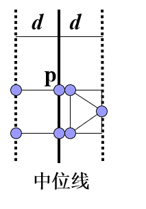
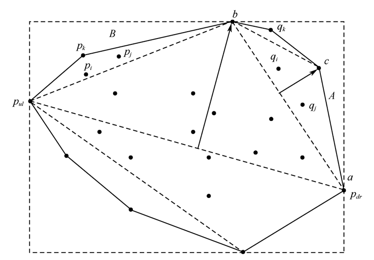

# 最近点对

> [!Note]
>
> 在二维平面上n个点中找距离最近的两个点（欧几里得距离）

## 分治法

对x差距较小的点进行暴力，得到局部最小值。

点对按x切分为左右子问题，分别计算左右局部最小值，考虑跨越切分线的点对

判断跨越点对时，有以下方法：

- 范围依照左右最小值的小值划定，无限长的定宽区域
- 考虑取半圆，扩充为长方形
- 优化方法一，按y轴排序，剪枝y差值大于小值的点对
- **最优方法：** 可以证明，对于临界区内的点，按y排序后，只需对比其后六个元素，其余元素的距离一定大于d
  
  

对于左右分区的每两个点，其距离都应该>=d，所以对于某个点p，其后可能出现“更近点”的范围是半圆，扩充为长方形。在此长方形左半边，最多四个点（符合>=d），右半边，最多三个点（左开右闭）。去掉自身后，最多计算六个点即可。

# 寻找凸包

> [!Note]
>
> 二维平面上n个点的集合Q，求Q的凸包
 
- 找到最下最左顶点，其他顶点与它连线
- 按夹角从小到大排序
- 夹角最小的开始，寻找凸包点

## 分治法

- 取两极端点，最右最下点pdr和最左最上点pul
- 有向线 $p_{dr}$ $p_{ul}$ 将整个凸包被划分为右凸包和左凸包
- 对右凸包和左凸包分别进行递归
- 
- 设 $S_1$ 是严格在直线 $p_{dr}$ $p_{ul}$ 右边的点集（S1可能是空集）
- 在 $S_1$ 中找距离直线 $p_{dr}$ $p_{ul}$ 最远的点b
- 连接 $p_{dr}$ 和 $b$ ，及 $b$ 和 $p_{ul}$
- 把 $p_{dr}b$ 右侧的点集记为 $A$， $bp_{ul}$ 右侧的点集的点记为 $B$
- 对边 $p_{dr}b$ 和点集 $A$、对边 $bp_{ul}$ 和点集B分别递归调用

**平均复杂度 $ O(n \log n)$**

**最差复杂度 $O(n^2)$**

