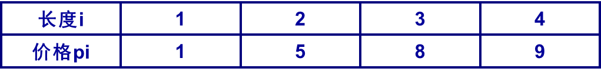

# DP 动态规划

## 动态规划的条件

- 最优子结构
    当一个问题的最优解包含了子问题的最优解时，称这个问题具有最优子结构
- 重叠子问题
    在问题的求解过程中，很多子问题的解将被多次使用

## 矩阵连乘

### 解空间大小
对于n个矩阵的连乘，考虑其可能的加括号方式

$$
    \begin{cases}
        P(1) = 1 \\ 
        P(n) = \sum_{k=1}^{n-1} P(k) \times P(n-k)
    \end{cases}
$$

这个递推式被称为卡特兰数（Catalan Number），其通项公式为：
$$P(n) = \frac{C(2n-1, n-1)}{n}$$

**解空间巨大无法枚举**
**具有最优子结构：问题的最优解包括子问题最优解**
**自底向上方法**
**递归备忘录方法**
[矩阵连乘](03\Matrix_multiplication_Solution_space_size.cpp)

## 钢条切割

> [!Note]
> 长度为n英寸的钢条进行切割，可有很多切法
> 
> 求最大价格
### 背包

对于长度为n的钢条：
- dp[i] 表示长度为 i 的钢条的最大价值
对于切分方案
- v[k] 表示第i种切分的钢条的价值
- w[k] 表示第k种切分的钢条的长度

状态转移方程：
$$dp[i] = max\{dp[i], \max_{1 \leq k < m}\{v[k] + dp[i - w[k]] \}\}$$

边界条件：
$$dp[0] = 0$$

[背包切割钢条](03/Steel_bar_cutting.cpp)