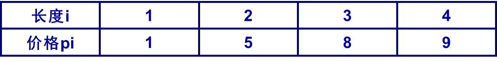

# DP 动态规划

## 动态规划的条件

- 最优子结构
    当一个问题的最优解包含了子问题的最优解时，称这个问题具有最优子结构
- 重叠子问题
    在问题的求解过程中，很多子问题的解将被多次使用

## 矩阵连乘

### 解空间大小
对于n个矩阵的连乘，考虑其可能的加括号方式

$$
    \begin{cases}
        P(1) = 1 \\ 
        P(n) = \sum_{k=1}^{n-1} P(k) \times P(n-k)
    \end{cases}
$$

这个递推式被称为卡特兰数（Catalan Number），其通项公式为：
$$P(n) = \frac{C(2n-1, n-1)}{n}$$

**解空间巨大无法枚举**
**具有最优子结构：问题的最优解包括子问题最优解**
**自底向上方法**
**递归备忘录方法**
[矩阵连乘](03\Matrix_multiplication_Solution_space_size.cpp)

## 钢条切割

> [!Note]
> 长度为n英寸的钢条进行切割，可有很多切法
> 
> 求最大价格
### 背包

对于长度为n的钢条：
- dp[i] 表示长度为 i 的钢条的最大价值
对于切分方案
- v[k] 表示第i种切分的钢条的价值
- w[k] 表示第k种切分的钢条的长度

状态转移方程：
$$dp[i] = max\{dp[i], \max_{1 \leq k < m}\{v[k] + dp[i - w[k]] \}\}$$

边界条件：
$$dp[0] = 0$$

[背包切割钢条](03/Steel_bar_cutting.cpp)

## 最长公共子序列(LCS)

> ![Note]
> X=(A, B, C, D, E, F, G)
> Z=(B, C, E, F)是 X 的子序例
> W=(B, D, A)不是X的子序例

> 给出两个序列
> 求最长子序列长度

### 最优子结构

设序列X，Y
令Z是X和Y的LCS，则：

1. 若$x_m = y_n$，则$z_k = x_m = y_n$，且$Z_{1:k-1}$是$X_{1:m-1}$和$Y_{1:n-1}$的LCS
2. 若$x_m \neq y_n$，且$z_k \neq x_m$，则$Z$是$X_{1:m-1}$和$Y$的LCS
3. 若$x_m \neq y_n$，且$z_k \neq y_n$，则$Z$是$X$和$Y_{1:n-1}$的LCS

### 递推公式

设c[i,j]表示Xi和Yj的LCS长度，则：

$$
c[i,j] = \begin{cases}
0 & \text{if } i=0 \text{ or } j=0 \\
c[i-1,j-1] + 1 & \text{if } i,j>0 \text{ and } x_i=y_j \\
\max(c[i,j-1], c[i-1,j]) & \text{if } i,j>0 \text{ and } x_i \neq y_j
\end{cases}
$$

[LCS](03/lcs.cpp)