```mermaid
gantt
    title FCFS
    dateFormat  SSS
    axisFormat  %L
    P1 :p1, 000, 5ms
    P2 :p2, after p1, 3ms
    P3 :p3, after p2, 1ms
    P4 :p4, after p3, 7ms
    P5 :p5, after p4, 4ms
```

```mermaid
gantt
    title SJF
    dateFormat  SSS
    axisFormat  %L
    P3 :p3, 000, 1ms
    P2 :p2, after p3, 3ms
    P5 :p5, after p2, 4ms
    P1 :p1, after p5, 5ms
    P4 :p4, after p1, 7ms
```

```mermaid
gantt
    title 非抢占优先级
    dateFormat  SSS
    axisFormat  %L
    P1 :p1, 000, 5ms
    P5 :p5, after p1, 4ms
    P3 :p3, after p5, 1ms
    P4 :p4, after p3, 7ms
    P2 :p2, after p4, 3ms
```

```mermaid
gantt
    title RR
    dateFormat  SSS
    axisFormat  %L
    P1 :p1, 000, 2ms
    P2 :p2, after p1, 2ms
    P3 :p3, after p2, 1ms
    P4 :p4, after p3, 2ms
    P5 :p5, after p4, 2ms
    P1 :p1_1, after p5, 2ms
    P2 :p2_1, after p1_1, 1ms
    P4 :p4_1, after p2_1, 2ms
    P5 :p5_1, after p4_1, 2ms
    P1 :p1_2, after p5_1, 1ms
    P4 :p4_2, after p1_2, 2ms
    P4 :p4_3, after p4_2, 1ms
```

```mermaid
gantt
    title 抢占式，基于优先级的循环调度算法
    dateFormat  SSS
    axisFormat  %L
    P1 :p1, 000, 10ms
    P1 :p1_1, after p1, 5ms
    P2 :p2, after p1_1, 5ms
    P3 :p3, after p2, 10ms
    P4 :p4, after p3, 10ms
    P3 :p3_1, after p4, 5ms
    P5 :p5, after p3_1, 5ms
    P4 :p4_1, after p5, 5ms
    P6 :p6, after p4_1, 10ms
    P6 :p6_1, after p6, 5ms
    P3 :p3_2, after p6_1, 5ms
    P4 :p4_2, after p3_2, 5ms
    P2 :p2_1, after p4_2, 10ms
    P2 :p2_2, after p2_1, 5ms
```

# 5.17

## a

## b

| 调度算法     | FCFS            | SJF             | 非抢占优先级     | RR                |
| ------------ | --------------- | --------------- | ---------------- | ----------------- |
| **周转时间** | 5，8，9，16，20 | 1，4，8，13，20 | 5，9，10，17，20 | 17，12，5，20，16 |

## c

| 调度算法     | FCFS            | SJF            | 非抢占优先级    | RR            |
| ------------ | --------------- | -------------- | --------------- | ------------- |
| **等待时间** | 0，5，8，19，26 | 0，1，4，8，13 | 0，5，9，10，17 | 0，2，4，5，7 |

## d

RR

# 5.18

## a

## b

| 进程         | P1   | P2   | P3   | P4   | P5   | P6   |
| ------------ | ---- | ---- | ---- | ---- | ---- | ---- |
| **周转时间** | 15   | 95   | 55   | 55   | 5    | 15   |

## c

| 进程         | P1   | P2   | P3   | P4   | P5   | P6   |
| ------------ | ---- | ---- | ---- | ---- | ---- | ---- |
| **等待时间** | 0    | 15   | 0    | 5    | 0    | 0    |