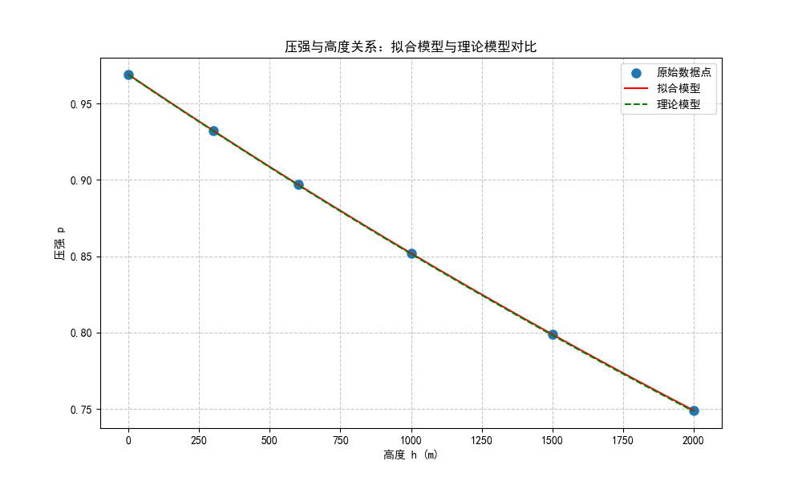
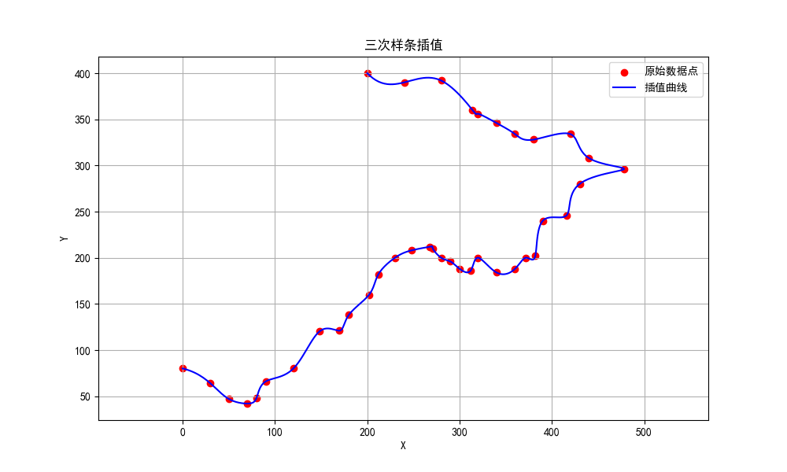

## 1

代码：
```python
import numpy as np
import matplotlib.pyplot as plt

plt.rcParams['font.sans-serif'] = ['SimHei']  # 用来正常显示中文标签
plt.rcParams['axes.unicode_minus'] = False  # 用来正常显示负号

# 拟合大气压强与高度的关系
# 1. 数据
# 高度
h = np.array([0, 300, 600, 1000, 1500, 2000])
# 大气压强
p = np.array([0.9689, 0.9322, 0.8969, 0.8519, 0.7989, 0.7491])

# 2. 拟合
# 指数拟合
# p = exp(a + b * h)
# ln(p) = a + b * h
# y = ln(p), x = h
y = np.log(p)
x = h
# 求解线性方程
A = np.vstack([x, np.ones(len(x))]).T
b, a = np.linalg.lstsq(A, y, rcond=None)[0]

# 理论公式
# P = 1.0332 * e ^ - (x + 500)/7756

# 计算每隔100m的压强值，并与理论公式比较
h_dense = np.arange(0, 2001, 100)  # 0到2000米，每隔100米

# 拟合模型计算的压强值
p_fit = np.exp(b * h_dense + a)

# 理论模型计算的压强值
p_theory = 1.0332 * np.exp(-(h_dense + 500) / 7756)

# 创建结果表格
results = np.column_stack((h_dense, p_fit, p_theory, np.abs(p_fit - p_theory)))
print("\n高度(m)  拟合值    理论值    差值")
print("------------------------------")
for row in results:
    print(f"{int(row[0]):4d}    {row[1]:.4f}  {row[2]:.4f}  {row[3]:.4f}")

# 计算均方误差
mse = np.mean((p_fit - p_theory)**2)
print(f"\n均方误差: {mse:.6f}")

# 可视化拟合结果与理论模型的对比
plt.figure(figsize=(10, 6))
plt.plot(h, p, 'o', label='原始数据点', markersize=8)
plt.plot(h_dense, p_fit, 'r-', label='拟合模型')
plt.plot(h_dense, p_theory, 'g--', label='理论模型')
plt.xlabel('高度 h (m)')
plt.ylabel('压强 p')
plt.title('压强与高度关系：拟合模型与理论模型对比')
plt.legend()
plt.grid(True, linestyle='--', alpha=0.7)
plt.show()
```

输出结果：
```
高度(m)  拟合值    理论值    差值
------------------------------
   0    0.9689  0.9687  0.0002
 100    0.9565  0.9563  0.0002
 200    0.9443  0.9440  0.0002
 300    0.9322  0.9319  0.0003
 400    0.9203  0.9200  0.0003
 500    0.9085  0.9082  0.0003
1600    0.7887  0.7881  0.0005
1700    0.7786  0.7780  0.0005
1800    0.7686  0.7681  0.0006
1900    0.7588  0.7582  0.0006
2000    0.7491  0.7485  0.0006

均方误差: 0.000000
```

拟合模型与理论模型的对比图：


## 3

代码：
```python
import numpy as np
from scipy import interpolate
import matplotlib.pyplot as plt

plt.rcParams['font.sans-serif'] = ['SimHei']  # 用来正常显示中文标签
plt.rcParams['axes.unicode_minus'] = False  # 用来正常显示负号
# 数据
x = np.array([0,30,50,70,80,90,120,148,170,180,202,212,230,248,268,271,280,290,300,312,320,340,360,372,382,390,416,430,478,440,420,380,360,340,320,314,280,240,200])
y = np.array([80,64,47,42,48,66,80,120,121,138,160,182,200,208,212,210,200,196,188,186,200,184,188,200,202,240,246,280,296,308,334,328,334,346,356,360,392,390,400])

# 创建一个时间序列
t = np.arange(len(x))

# 使用三次样条插值
cs = interpolate.CubicSpline(t, np.c_[x, y])

# 生成插值曲线的坐标
t_fine = np.linspace(0, len(x)-1, 500)
x_fine, y_fine = cs(t_fine).T

# 绘制原始数据点和插值曲线
plt.figure(figsize=(10, 6))
plt.scatter(x, y, color='red', label='原始数据点')
plt.plot(x_fine, y_fine, 'b-', label='插值曲线')
plt.title('三次样条插值')
plt.xlabel('X')
plt.ylabel('Y')
plt.grid(True)
plt.legend()
plt.axis('equal')  # Equal scaling for x and y
plt.show()

# 计算插值曲线的长度
length = np.sum(np.sqrt(np.diff(x_fine)**2 + np.diff(y_fine)**2))
print('插值曲线的长度为：', length)
```

输出结果：
```
插值曲线的长度为： 990.5928518254875
```

插值曲线图：
