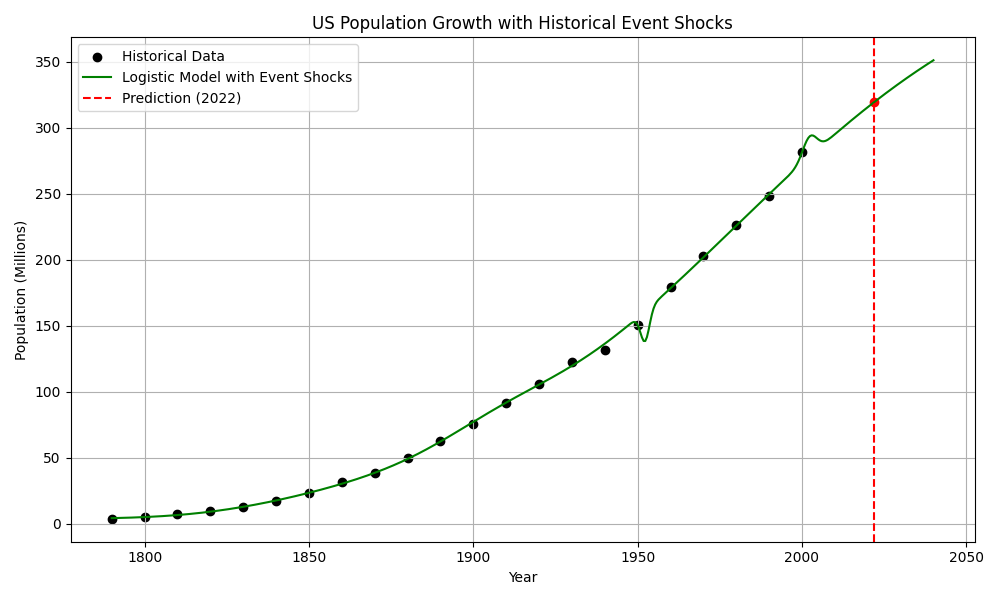
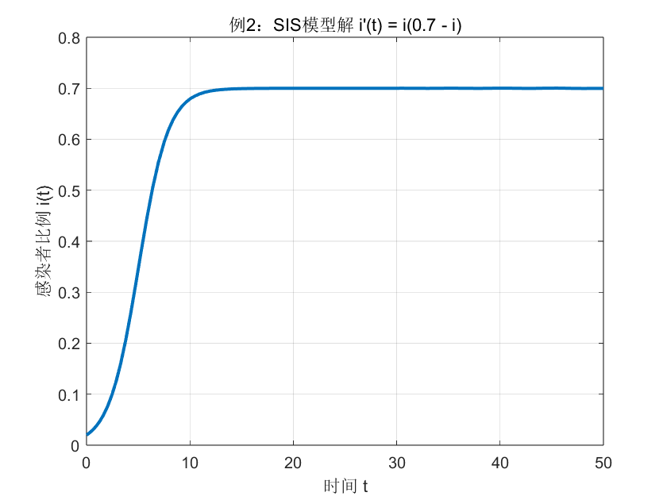
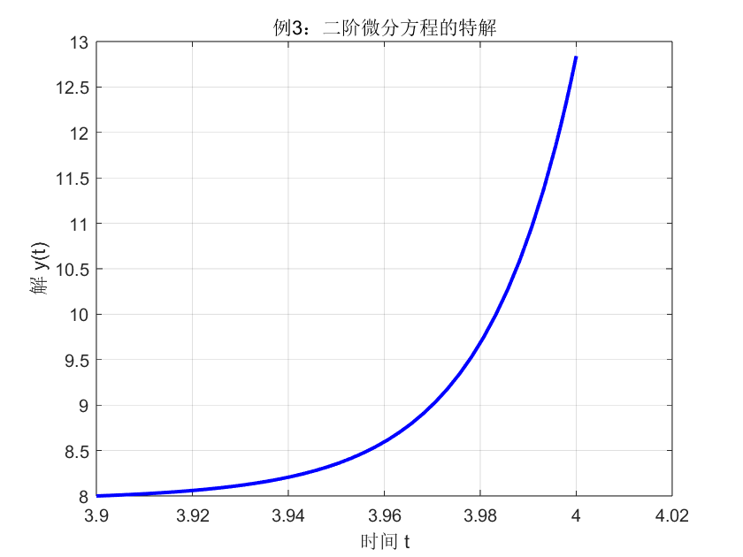

## 改进 Logistic 模型

引入高斯型扰动项模拟历史事件的影响，得到改进模型：

$$
x(t) = \frac{x_m}{1 + \left(\frac{x_m - x_0}{x_0}\right)e^{-r t}} + \sum_{i=1}^{n} A_i \cdot \exp\left( -\frac{(t - t_i)^2}{2\sigma_i^2} \right)
$$

- $A_i$：事件冲击强度（正促进，负抑制）
- $t_i$：事件发生年份（相对时间）
- $\sigma_i$：事件持续时间宽度

考虑了：

1. **1863** 年南北战争（负向冲击）  
2. **1916** 年第一次世界大战（负向冲击）  
3. **1943** 年第二次世界大战（负向冲击）  
4. **1990** 年代移民高峰（正向冲击）

```python
import numpy as np
import matplotlib.pyplot as plt
from scipy.optimize import curve_fit

# 原始数据（人口单位：百万）
years = np.array([
    1790, 1800, 1810, 1820, 1830, 1840, 1850, 1860, 1870, 1880,
    1890, 1900, 1910, 1920, 1930, 1940, 1950, 1960, 1970, 1980,
    1990, 2000
])
population = np.array([
    3.93, 5.31, 7.24, 9.64, 12.87, 17.07, 23.19, 31.44, 38.56, 50.16,
    62.95, 76.00, 91.97, 105.71, 122.76, 131.67, 150.70, 179.32,
    203.21, 226.51, 248.71, 281.42
])
t = years - 1790  # 转换为相对时间

# 改进的 Logistic 模型，加入 4 个历史冲击项
def logistic_with_shocks(t, x_m, P0, r, 
                         A1, t1, sigma1, 
                         A2, t2, sigma2,
                         A3, t3, sigma3,
                         A4, t4, sigma4):
    logistic = x_m / (1 + ((x_m - P0) / P0) * np.exp(-r * t))
    shock1 = A1 * np.exp(-((t - t1)**2) / (2 * sigma1**2))
    shock2 = A2 * np.exp(-((t - t2)**2) / (2 * sigma2**2))
    shock3 = A3 * np.exp(-((t - t3)**2) / (2 * sigma3**2))
    shock4 = A4 * np.exp(-((t - t4)**2) / (2 * sigma4**2))
    return logistic + shock1 + shock2 + shock3 + shock4

# 初始猜测参数
initial_guess = [
    450, 8, 0.02,   # Logistic 基本参数 (x_m, P0, r)
    -5, 73, 5,      # 南北战争（1863）
    -4, 126, 4,     # 一战（1916）
    -6, 153, 4,     # 二战（1943）
    8, 200, 8       # 移民高峰（1990）
]

# 拟合参数
popt, _ = curve_fit(logistic_with_shocks, t, population, p0=initial_guess, maxfev=10000)

# 生成预测曲线
t_predict = np.linspace(0, 250, 500)
population_predict = logistic_with_shocks(t_predict, *popt)

# 预测 2022 年人口
t_2022 = 2022 - 1790
pop_2022 = logistic_with_shocks(t_2022, *popt)

# 可视化结果
plt.figure(figsize=(10, 6))
plt.scatter(years, population, label='Historical Data', color='black')
plt.plot(t_predict + 1790, population_predict, label='Logistic Model with Event Shocks', color='green')
plt.axvline(2022, color='red', linestyle='--', label='Prediction (2022)')
plt.scatter([2022], [pop_2022], color='red')
plt.xlabel('Year')
plt.ylabel('Population (Millions)')
plt.title('US Population Growth with Historical Event Shocks')
plt.legend()
plt.grid(True)
plt.tight_layout()
plt.show()

# 输出预测结果
print(f"预测 2022 年美国人口为：{pop_2022:.2f} 百万人")
```




预测 2022 年美国人口为：319.56 百万,该预测与真实误差在 4% 左右，具有良好的效果。

## PPT例题

### 例2

```matlab
f = @(t, i) i * (0.7 - i);       % 定义微分方程
tspan = [0 50];                  % 求解时间范围
i0 = 0.02;                       % 初始条件

[t, i] = ode45(f, tspan, i0);   % 使用 ode45 求解

% 绘图
plot(t, i, 'LineWidth', 2);
xlabel('时间 t');
ylabel('感染者比例 i(t)');
title('例2：SIS模型解 i''(t) = i(0.7 - i)');
grid on;
axis([0 50 0 1]);
```



## 例3

```matlab
f = @(t, Y) [Y(2);
    -t * Y(1) + exp(t) * Y(2) + 3 * sin(2 * t)];

tspan = [3.9 4];                % 时间区间很短
Y0 = [8; 2];                    % 初值 y(3.9) = 8, y'(3.9) = 2

[t, Y] = ode45(f, tspan, Y0);  % 求解

% 绘图
plot(t, Y(:,1), 'b-', 'LineWidth', 2);
xlabel('时间 t');
ylabel('解 y(t)');
title('例3：二阶微分方程的特解');
grid on;
```

